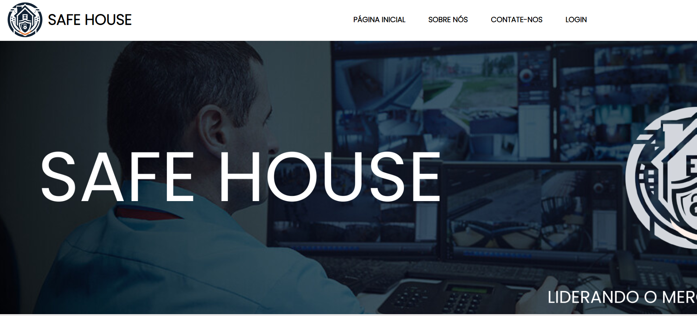
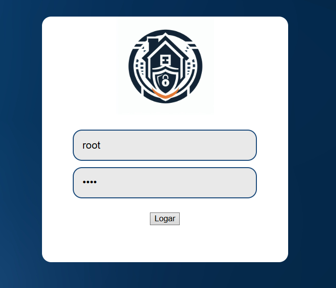
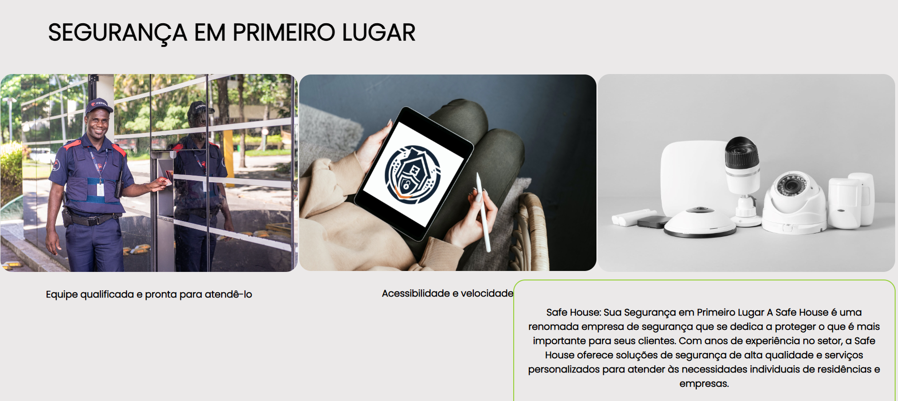
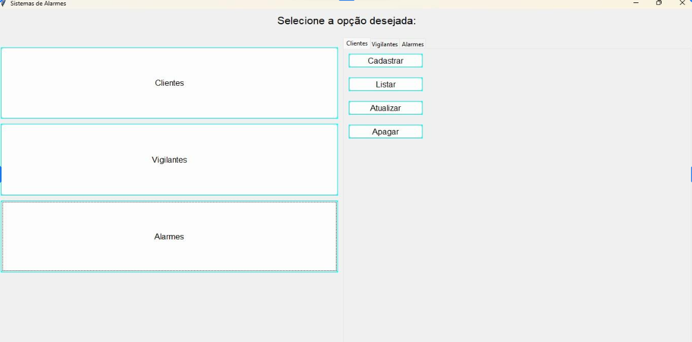

Sistema de monitoramento em tempo real desenvolvido para detectar e responder rapidamente a disparos de alarmes. Ao identificar um evento, o sistema aciona automaticamente um vigilante responsável, garantindo agilidade na resposta e maior segurança.

Além disso, todas as ocorrências são registradas, permitindo rastreabilidade e análise dos eventos.
## 📸 Preview

